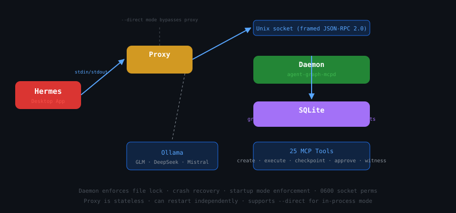

# agent-graph-mcp

**MCP server for graph-orchestrated LLM workflows** — 25 typed tools, daemon/proxy architecture, checkpoint/resume, human-in-the-loop approvals, and HMAC-authenticated execution receipts.

[](https://crates.io/crates/agent-graph-mcp)
[](https://docs.rs/agent-graph-mcp)
[](https://lobehub.com/mcp/recursiveintell-agent-graph-mcp)
[](https://www.npmjs.com/package/@recursiveintell/agent-graph-mcp)
[](LICENSE-MIT)



> **Expose the `ri-agent-graph` runtime engine over MCP.** Compile declarative JSON workflow specs, execute synchronously or asynchronously, checkpoint/resume, request human approval, capture source witnesses, and get cryptographic receipts — all through 25 typed MCP tools.

## Quick start

### npx (recommended)

```bash
npx -y @recursiveintell/agent-graph-mcp --direct --base-url http://127.0.0.1:11434 --model glm-5.2:cloud
```

### Cargo install

```bash
cargo install agent-graph-mcp --locked
agent-graph-mcp --direct --base-url http://127.0.0.1:11434 --model glm-5.2:cloud
```

### Daemon mode (production)

```bash
agent-graph-mcpd --data-dir ~/.local/share/agent-graph --socket /tmp/agent-graph.sock &
agent-graph-mcp --socket /tmp/agent-graph.sock
```

## Client configs

**Hermes Agent:**
```yaml
mcp_servers:
  agent_graph:
    command: agent-graph-mcp
    args: [--socket, /tmp/agent-graph.sock]
```

**Claude Desktop:**
```json
{"mcpServers": {"agent-graph": {"command": "npx", "args": ["-y", "@recursiveintell/agent-graph-mcp", "--direct", "--base-url", "http://127.0.0.1:11434", "--model", "glm-5.2:cloud"]}}}
```

## Architecture

```
MCP Client ──→ agent-graph-mcp (proxy) ──Unix socket──→ agent-graph-mcpd (daemon) ──→ SQLite
               stdin/stdout                 framed              Tokio async I/O
```

## Tools (25)

**Graph lifecycle (4):** `graph_create`, `graph_list`, `graph_inspect`, `graph_render`
**Execution (5):** `graph_execute`, `graph_run_start`, `graph_run_wait`, `graph_run_cancel`, `graph_run_get`
**State & checkpoint (4):** `graph_run_state`, `graph_run_events`, `graph_run_checkpoint`, `graph_run_resume`
**HITL approval (3):** `graph_approval_list`, `graph_approval_get`, `graph_approval_request`
**Evidence (2):** `graph_source_witness_capture`, `graph_source_witness_get`
**Templates (4):** `graph_template_list`, `graph_template_instantiate`, `graph_template_candidates`, `graph_template_outcomes`
**Receipts & status (3):** `graph_policy_check`, `graph_run_receipt`, `graph_status`

## Built-in templates

| Template | Description |
|----------|-------------|
| `council_deliberation` | 3-analyst parallel council |
| `parallel_council` | 2-person debate |
| `plan_critique_refine` | plan → critique → refine |
| `analysis_pipeline` | planner → researcher → extractor → synthesizer → validator |
| `classifier_router` | LLM classifier → bug/feature/question handlers |

## Ecosystem

| Crate | Role |
|-------|------|
| [agent-graph-mcp](https://crates.io/crates/agent-graph-mcp) | MCP server (this repo) |
| [ri-agent-graph](https://crates.io/crates/ri-agent-graph) | Core graph engine |
| [llm-pipeline](https://crates.io/crates/llm-pipeline) | LLM node payloads |
| [stack-ids](https://crates.io/crates/stack-ids) | Trace primitives |

## Verification

```bash
# Smoke test — 25 tools
echo '{"jsonrpc":"2.0","id":2,"method":"tools/list","params":{}}' | \
  npx -y @recursiveintell/agent-graph-mcp --direct --base-url http://127.0.0.1:11434 --model glm-5.2:cloud 2>/dev/null | \
  python3 -c "import sys,json; msg=json.loads(sys.stdin.read()); print(f'{len(msg[\"result\"][\"tools\"])} tools')"

# Build + test
cargo build --release
cargo test --lib --test daemon_recovery --test mcp_integration
```

## License

MIT © [RecursiveIntell](https://github.com/RecursiveIntell)
