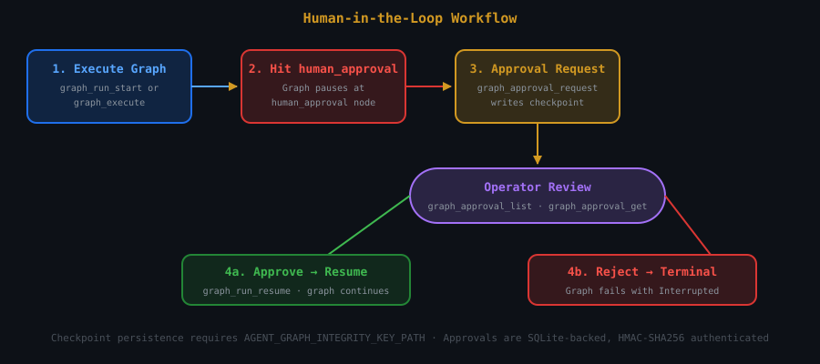

# agent-graph-mcp

**Run 9 agents at once.** MCP server for graph-orchestrated LLM workflows — dispatch up to 16 LLM nodes in parallel fan-out with typed joins, checkpoint/resume, human-in-the-loop approvals, and HMAC-authenticated execution receipts. 27 typed tools.

[](https://crates.io/crates/agent-graph-mcp)
[](https://docs.rs/agent-graph-mcp)
[](https://lobehub.com/mcp/recursiveintell-agent-graph-mcp)
[](https://www.npmjs.com/package/@recursiveintell/agent-graph-mcp)
[](LICENSE-MIT)


> **Expose the `ri-agent-graph` runtime engine over MCP.** Compile declarative JSON workflow specs, execute synchronously or asynchronously, checkpoint/resume, request human approval, capture source witnesses, and get cryptographic receipts — all through 27 typed MCP tools.

## Who is this for?

**AI agent operators** who need multi-node LLM orchestration (parallel research sweeps, council deliberation, plan→critique→refine pipelines) through their existing MCP client (Hermes Agent, Claude Desktop, Cursor). **Not for** simple single-call LLM usage — use a direct provider integration for that.

## Quick start

### Prerequisites

- An LLM endpoint (local Ollama, or any OpenAI-compatible API)
- Node.js ≥ 18 (for npx) or Rust ≥ 1.75 (for cargo install)
- A model available at your endpoint. Examples below use `llama3.2:3b` (pull with `ollama pull llama3.2:3b`). Any model works — just replace `--model`.

### npx (recommended)

```bash
npx -y @recursiveintell/agent-graph-mcp --direct --base-url http://127.0.0.1:11434 --model llama3.2:3b
```

> **Note:** `--direct` is deprecated. Prefer daemon mode (below) for persistence and multi-client support. Direct mode still works but will be removed in a future release.

**Expected output:** MCP initialization handshake. Run `tools/list` to verify you see 27 tools.

### Cargo install

```bash
cargo install agent-graph-mcp --locked
agent-graph-mcp --direct --base-url http://127.0.0.1:11434 --model llama3.2:3b
```

### Daemon mode (multi-client, persistent state)

```bash
# Start the daemon (all defaults shown explicitly)
agent-graph-mcpd \
  --data-dir ~/.local/share/agent-graph \
  --socket /tmp/agent-graph/mcp.sock \
  --base-url http://127.0.0.1:11434 \
  --model llama3.2:3b \
  --max-graphs 256 &

# Connect proxy
agent-graph-mcp --socket /tmp/agent-graph/mcp.sock
```

**Defaults** (applied when flags are omitted):

| Flag | Default | Notes |
|------|---------|-------|
| `--data-dir` | `/tmp/agent-graph` | Ephemeral across reboots. Set explicitly for durable storage |
| `--socket` | `/tmp/agent-graph/mcp.sock` | Must match between daemon and proxy |
| `--base-url` | `http://127.0.0.1:11434` | Ollama default. Change for any provider |
| `--model` | `glm-5.2:cloud` | **Always override this.** The default exists only for backward compatibility |
| `--max-graphs` | 64 | Range 1–1024. Raise for large graph libraries |

`--max-graphs` is a per-daemon registration capacity. `graph_status` reports both the effective limit and `capacity_state`; an `over_limit_legacy` state preserves existing durable graphs but rejects new registrations until the configured limit is raised or registrations are retired.

### Direct vs daemon

| Mode | Use when |
|------|----------|
| `--direct` | Single MCP client, no persistence needed, simplest setup |
| `--socket` (daemon) | Multiple clients, durable graph storage, long-running workflows, HITL approvals |

## Provider and model configuration

Every graph run sends LLM calls to an OpenAI-compatible endpoint. You control **where** (`--base-url`) and **which model** (`--model`). The API key flows through the `OPENAI_API_KEY` environment variable.

### Setting your API key

All OpenAI-compatible providers use the same variable — `OPENAI_API_KEY`. Set it one of these ways:

```bash
# Inline (visible in process list — use only for testing)
OPENAI_API_KEY=sk-... agent-graph-mcpd --base-url https://api.deepseek.com/v1 --model deepseek-v4-pro

# Export (session-only)
export OPENAI_API_KEY=sk-...
agent-graph-mcpd --base-url https://api.deepseek.com/v1 --model deepseek-v4-pro

# systemd unit (persistent, recommended)
# Add to ~/.config/systemd/user/agent-graph-mcpd.service:
#   [Service]
#   Environment=OPENAI_API_KEY=sk-...
systemctl --user daemon-reload
systemctl --user restart agent-graph-mcpd
```

For convenience, the daemon also accepts `AGENT_GRAPH_API_KEY` — if set, it takes precedence over `OPENAI_API_KEY`. Use this when you want to isolate the agent-graph key from other tools that read `OPENAI_API_KEY`.

**Security note:** Never commit API keys to git, dotfiles, or shell history. Use a secrets manager (1Password CLI, `pass`, systemd `LoadCredential=`) or set the environment at boot.

### Provider-specific keys

| Provider | Key format | Where to get it |
|----------|-----------|-----------------|
| DeepSeek | `sk-...` | [platform.deepseek.com/api_keys](https://platform.deepseek.com/api_keys) |
| OpenAI | `sk-proj-...` or `sk-...` | [platform.openai.com/api-keys](https://platform.openai.com/api-keys) |
| OpenRouter | `sk-or-v1-...` | [openrouter.ai/keys](https://openrouter.ai/keys) |
| Alibaba MaaS | `sk-...` | Alibaba Cloud console → Model Studio → API Keys |
| Ollama | None required | Local, no key needed |

All providers use the same env var name. Just set `OPENAI_API_KEY` to the key for whichever provider you're pointing `--base-url` at.

### Daemon mode (persistent)

```bash
# Ollama (local)
agent-graph-mcpd --base-url http://127.0.0.1:11434 --model llama3.2:3b

# OpenAI
OPENAI_API_KEY=sk-... agent-graph-mcpd --base-url https://api.openai.com/v1 --model gpt-4o

# DeepSeek
OPENAI_API_KEY=sk-... agent-graph-mcpd --base-url https://api.deepseek.com/v1 --model deepseek-v4-pro

# OpenRouter (any model)
OPENAI_API_KEY=sk-or-... agent-graph-mcpd --base-url https://openrouter.ai/api/v1 --model openai/gpt-4o

# Alibaba MaaS (note: has gateway body-size limits — large councils may need trimming)
OPENAI_API_KEY=sk-... agent-graph-mcpd --base-url https://llm-<id>.ap-southeast-1.maas.aliyuncs.com/compatible-mode --model deepseek-v4-flash
```

### Direct mode (ephemeral, same flags)

```bash
npx -y @recursiveintell/agent-graph-mcp --direct --base-url https://api.deepseek.com/v1 --model deepseek-v4-pro
```

### Current state

| Provider | Tested | Notes |
|----------|--------|-------|
| Ollama (local) | ✅ daily | Lowest latency, no API key needed |
| DeepSeek | ✅ daily | Primary cloud provider. `deepseek-v4-pro` for large councils, `deepseek-v4-flash` for fast fan-out |
| OpenRouter | ✅ works | Any model, pay-per-token. Set `OPENAI_API_KEY` to your OpenRouter key |
| OpenAI | ⚠️ compatible | Untested but OpenAI-compatible. Same flag pattern |
| Alibaba MaaS | ⚠️ body-size limit | Gateway rejects payloads > ~100KB — trim council context before dispatch |

**Choosing a model for agent-graph:** Fan-out nodes share the same model. For 9-agent sweeps, use a fast model (`deepseek-v4-flash`, `llama3.2:3b`). For synthesis/report nodes that process all collected results, prefer a larger-context model (`deepseek-v4-pro`, `gpt-4o`). The daemon currently uses a single model for all nodes in a graph; per-node model selection is tracked but not yet shipped.

## Complete CLI reference

### Daemon (`agent-graph-mcpd`)

| Flag | Default | Description |
|------|---------|-------------|
| `--data-dir PATH` | `/tmp/agent-graph` | Persistent storage. Set for durable graphs across restarts |
| `--socket PATH` | `/tmp/agent-graph/mcp.sock` | Unix socket for proxy connections |
| `--base-url URL` | `http://127.0.0.1:11434` | OpenAI-compatible LLM endpoint |
| `--model NAME` | `glm-5.2:cloud` | Default model for all LLM nodes. **Override this** |
| `--max-graphs N` | 64 | Graph registration capacity (1–1024) |
| `--help` | | Print usage |
| `--version` | | Print version |

### Proxy (`agent-graph-mcp`)

| Flag | Default | Description |
|------|---------|-------------|
| `--socket PATH` | `$XDG_RUNTIME_DIR/agent-graph/mcp.sock` or `/tmp/agent-graph/mcp.sock` | Daemon socket to connect to |
| `--connect-timeout-ms N` | 2000 | Connection timeout in milliseconds |
| `--version` | | Print version |

### Direct mode (`agent-graph-mcp --direct`) — deprecated

Prefers daemon mode. All daemon flags above plus:

| Flag | Description |
|------|-------------|
| `--integrity-key PATH` | HMAC key file for receipt authentication |
| `--require-integrity-key` | Refuse startup if integrity key is missing/unreadable (requires `--data-dir`) |
| `--ephemeral` | In-memory only, no persistence (mutually exclusive with `--data-dir`) |

### Environment variables

| Variable | Used by | Description |
|----------|---------|-------------|
| `OPENAI_API_KEY` | Daemon, direct | API key for the LLM provider. Works for all OpenAI-compatible endpoints (DeepSeek, OpenAI, OpenRouter, etc.) |
| `AGENT_GRAPH_API_KEY` | Daemon, direct | Optional. Takes precedence over `OPENAI_API_KEY`. Use to isolate the agent-graph key from other tools |
| `AGENT_GRAPH_INTEGRITY_KEY_PATH` | Daemon, direct | Alternative to `--integrity-key` for receipt signing |
| `RUST_LOG` | Both | Log level. Set to `debug` for verbose output |

## Client configs

**Hermes Agent:**
```yaml
mcp_servers:
  agent_graph:
    command: agent-graph-mcp
    args: [--socket, /tmp/agent-graph/mcp.sock]
```

**Claude Desktop:**
```json
{"mcpServers": {"agent-graph": {"command": "npx", "args": ["-y", "@recursiveintell/agent-graph-mcp", "--direct", "--base-url", "http://127.0.0.1:11434", "--model", "llama3.2:3b"]}}}
```

### Try it out

Once configured, your agent can use any of the 27 tools directly. Try these natural language prompts:

> "Use the `council_deliberation` template to debate the merits of Rust vs. Go for systems programming."

> "Create a graph with 3 parallel research nodes analyzing web framework tradeoffs, join the results, and produce a ranked recommendation."

> "Spin up a plan→critique→refine pipeline for a database migration strategy, and pause for my approval before the final report."

## 9 agents at once

Fan out to 9 LLM nodes in parallel, then join results into one synthesis:

```json
{
  "name": "9-agent-research-sweep",
  "entry": "fanout",
  "nodes": [
    {"id": "fanout", "type": "passthrough"},
    {"id": "agent_0", "type": "llm", "prompt": "Research topic A: {input}"},
    {"id": "agent_1", "type": "llm", "prompt": "Research topic B: {input}"},
    {"id": "agent_2", "type": "llm", "prompt": "Research topic C: {input}"},
    {"id": "agent_3", "type": "llm", "prompt": "Analyze dimension 1: {input}"},
    {"id": "agent_4", "type": "llm", "prompt": "Analyze dimension 2: {input}"},
    {"id": "agent_5", "type": "llm", "prompt": "Analyze dimension 3: {input}"},
    {"id": "agent_6", "type": "llm", "prompt": "Critique from angle X: {input}"},
    {"id": "agent_7", "type": "llm", "prompt": "Critique from angle Y: {input}"},
    {"id": "join", "type": "join", "config": {"inputs": ["agent_0","agent_1","agent_2","agent_3","agent_4","agent_5","agent_6","agent_7"], "output": "collected", "mode": "collect_array"}},
    {"id": "report", "type": "llm", "prompt": "Synthesize findings from all agents and produce final report: {collected}"}
  ],
  "edges": [
    {"from": "fanout", "to": "agent_0"}, {"from": "fanout", "to": "agent_1"},
    {"from": "fanout", "to": "agent_2"}, {"from": "fanout", "to": "agent_3"},
    {"from": "fanout", "to": "agent_4"}, {"from": "fanout", "to": "agent_5"},
    {"from": "fanout", "to": "agent_6"}, {"from": "fanout", "to": "agent_7"},
    {"from": "agent_0", "to": "join"}, {"from": "agent_1", "to": "join"},
    {"from": "agent_2", "to": "join"}, {"from": "agent_3", "to": "join"},
    {"from": "agent_4", "to": "join"}, {"from": "agent_5", "to": "join"},
    {"from": "agent_6", "to": "join"}, {"from": "agent_7", "to": "join"},
    {"from": "join", "to": "report"}, {"from": "report", "to": "END"}
  ],
  "max_parallelism": 9
}
```

All 9 LLM calls execute concurrently via Tokio `JoinSet`. The join node collects results from agents 0-7 into `{collected}`, then the report node synthesizes. Scale up to 16 branches per parallel node.

## Loop and subgraph nodes

- **`loop`** — bounded iteration. Config: `{"entry": "<body node>", "exit": "<node>|END", "max_iterations": 1..=32}`. The loop node re-enters `entry` (body should edge back to the loop node to sustain the cycle) and navigates to `exit` once the iteration budget is exhausted. The iteration counter lives in `__loop__:<loop node id>` and can be read by the body via `input_key`. Graph-level `max_iterations` is the outer safety net.
- **`subgraph`** — execute another registered graph. Config: `{"graph_name": "<registered graph>", "input_key": "__input__", "output_key": "__subgraph_output__"}`. The referenced graph runs in-process with the parent's budget counters and cancellation; its terminal output is written under `output_key`. Nesting depth limit: 4.
- **`human_approval`** — effect gate. Writes `__approval_request__` (pending) to state and interrupts; the effect is NOT executed without authority. Durable approvals are checkpoint-bound (run with `checkpoint: true` on deterministic transform chains); deciding an approval requires the authenticated operator transport. See the doctrine register for the full §13 contract.

## Built-in templates

| Template | Description |
|----------|-------------|
| `council_deliberation` | 3-analyst parallel council with synthesis |
| `parallel_council` | 2-person debate with cross-examination |
| `plan_critique_refine` | plan → critique → refine pipeline |
| `analysis_pipeline` | planner → researcher → extractor → synthesizer → validator |
| `classifier_router` | LLM classifier → bug/feature/question handlers |

Templates are instantiated with `graph_template_instantiate` — no JSON authoring required.

## Architecture

```
MCP Client ──→ agent-graph-mcp (proxy) ──Unix socket──→ agent-graph-mcpd (daemon) ──→ SQLite
               stdin/stdout                 framed              Tokio async I/O
```



Human-in-the-loop approvals are backed by durable SQLite checkpoints. When a graph reaches an approval node, execution pauses, a checkpoint is persisted, and the approval is surfaced via `graph_approval_list`. The human reviews and decides; the graph resumes from the checkpoint.

## Tools (27)

**Graph lifecycle (4):** `graph_create`, `graph_list`, `graph_inspect`, `graph_render`
**Execution (5):** `graph_execute`, `graph_run_start`, `graph_run_wait`, `graph_run_cancel`, `graph_run_get`
**State & checkpoint (4):** `graph_run_state`, `graph_run_events`, `graph_run_checkpoint`, `graph_run_resume`
**HITL approval (3):** `graph_approval_list`, `graph_approval_get`, `graph_approval_request`
**Evidence (2):** `graph_source_witness_capture`, `graph_source_witness_get`
**Templates (4):** `graph_template_list`, `graph_template_instantiate`, `graph_template_candidates`, `graph_template_outcomes`
**Receipts & status (3):** `graph_policy_check`, `graph_run_receipt`, `graph_status`
**Retention (2):** `graph_retention_review`, `graph_retention_set`

## Ecosystem

| Crate | Role | Version |
|-------|------|---------|
| [agent-graph-mcp](https://crates.io/crates/agent-graph-mcp) | MCP server (this repo) | 0.2.6 |
| [ri-agent-graph](https://crates.io/crates/ri-agent-graph) | Core graph engine | 0.2 |
| [llm-pipeline](https://crates.io/crates/llm-pipeline) | LLM node payloads + retry | 0.2 |
| [stack-ids](https://crates.io/crates/stack-ids) | Trace primitives (TraceCtx, AttemptId) | 0.1 |

## Verification

```bash
# Smoke test — verify 27 tools are exposed
echo '{"jsonrpc":"2.0","id":2,"method":"tools/list","params":{}}' | \
  npx -y @recursiveintell/agent-graph-mcp --direct --base-url http://127.0.0.1:11434 --model llama3.2:3b 2>/dev/null | \
  python3 -c "import sys,json; msg=json.loads(sys.stdin.read()); print(f'{len(msg[\"result\"][\"tools\"])} tools')"
# Expected: 27 tools

# Build and test suite
cargo build --release
cargo test --lib --test daemon_recovery --test mcp_integration
```

**Test status (current `main`):** 57 lib tests pass, 1 known failure in `evidence::tests::witness_dependencies_verify_sqlite_content_and_span` (fixture dependency on semantic-memory-mcp binary path — tracked, does not affect runtime correctness). Integration tests (`daemon_recovery`, `mcp_integration`, `lifecycle`, `operator_authority`, etc.) pass.

## Troubleshooting

| Symptom | Likely cause | Fix |
|---------|-------------|-----|
| `tools/list` returns 0 or errors | MCP relay or daemon not running | Verify daemon: `agent-graph-mcpd --data-dir ... &`. Check `graph_status` |
| LLM nodes hang | Provider unreachable or model name wrong | Test endpoint: `curl <your-base-url>/models` (Ollama) or `curl -H "Authorization: Bearer $OPENAI_API_KEY" <your-base-url>/models` (cloud) |
| `graph_run_start` returns immediately | Run is async by default | Use `graph_run_wait` to block on completion, or `graph_execute` for sync |
| "socket not found" | Daemon not started or socket path mismatch | Ensure `--socket` matches between daemon and proxy. Default is `/tmp/agent-graph/mcp.sock` |
| Approval stuck | Human hasn't decided | Check `graph_approval_list`, use `graph_approval_request` with decision |
| Execution hangs silently | Logging too quiet | Run daemon with `RUST_LOG=debug agent-graph-mcpd ...` — logs to stderr. For `--direct` mode, add `RUST_LOG=debug` before the command |
| Unknown model errors | Default model is `glm-5.2:cloud` | Always pass `--model`. The default exists for backward compatibility and won't exist on your endpoint |

## Status and limitations

- **Published:** crates.io + npm. Version 0.2.6.
- **Tested on:** Linux (Nobara/Fedora). macOS works via npx. Windows untested.
- **No CI currently configured.** All verification is local.
- **Durable execution** requires the daemon. Direct mode is ephemeral.
- **Max parallelism:** 16 nodes per parallel fan-out (compiler-enforced).
- **LLM providers:** any OpenAI-compatible endpoint. See [Provider and model configuration](#provider-and-model-configuration) for tested providers and setup.

## Support, security, and contributing

- **Issues and discussions:** [GitHub Issues](https://github.com/RecursiveIntell/agent-graph-mcp/issues)
- **Security:** [SECURITY.md](SECURITY.md) — report vulnerabilities privately via GitHub Security Advisories
- **Contributing:** [CONTRIBUTING.md](CONTRIBUTING.md) — setup, workflow, code style, and PR expectations
- **Code of Conduct:** [CODE_OF_CONDUCT.md](CODE_OF_CONDUCT.md) — Contributor Covenant 2.1
- **AI agents:** [AGENTS.md](AGENTS.md) — project structure, conventions, and constraints for coding agents

## License

MIT © [RecursiveIntell](https://github.com/RecursiveIntell)
